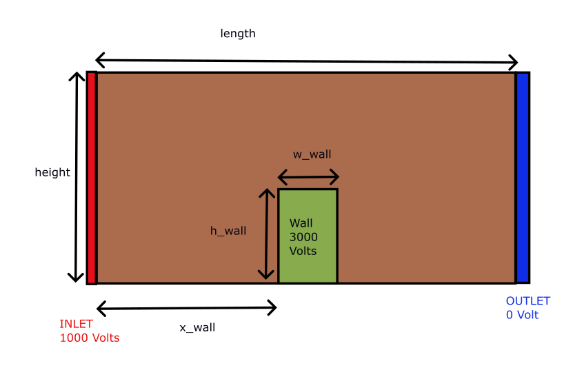

# Particle in Cell Simulation for Plasma

2024 Spring APC 523 Final Project

Positively charge particles enter the simulation domain from the inlet and exposed to an electric field due to imposed boundary conditions. Particles feel some electric force and their trajectory is tracked until they leave the simulation domain. All of the walls are assumed to reflect the particles.

How to run
---
After cloning the repo simply run following command,
`python -m pic`
On this branch, this command will make the analytic solution figure.

Group Members
---

- Nathaniel CHEN
- Yigit Gunsur ELMACIOGLU
- Kian ORR
- Dario PANICI

